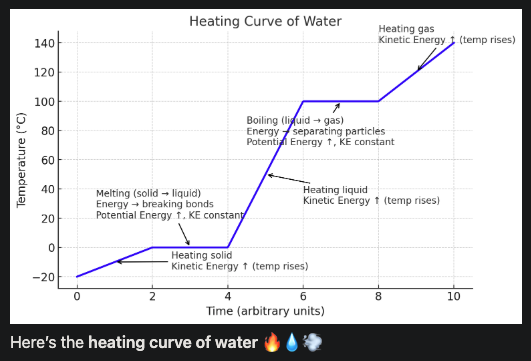
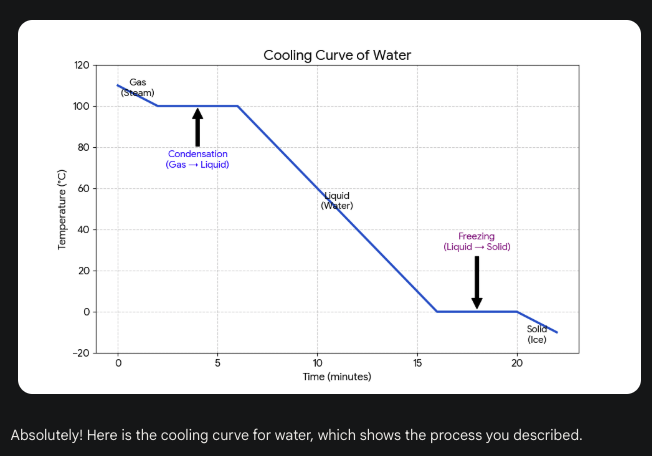
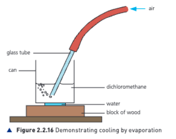
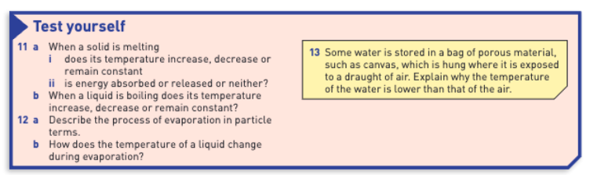
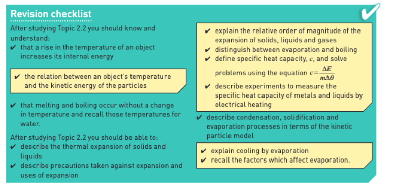
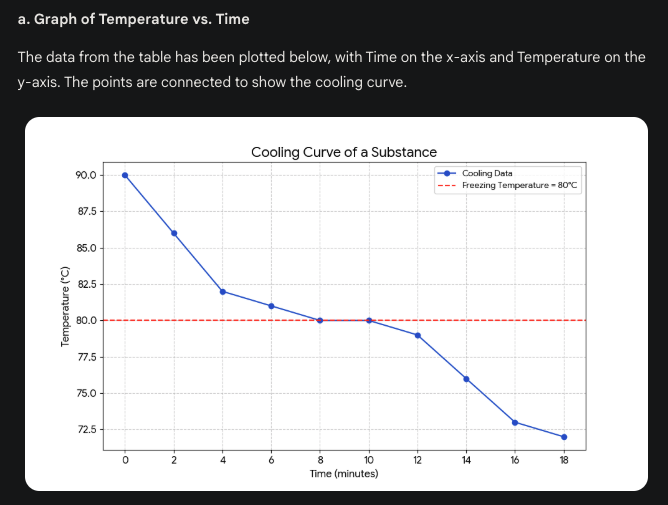

## The **anomalous expansion of water** refers to the unusual behavior of water when it is cooled below 4 °C.

For most substances:

* Cooling → particles come closer → volume decreases → density increases.

But water behaves differently:

* When water is cooled from higher temperatures, it **contracts** as expected until it reaches **4 °C**.
* **Below 4 °C**, instead of continuing to contract, water **expands** on further cooling until it freezes at 0 °C.
* Ice (0 °C) is even less dense than liquid water, which is why it floats.

### Key points:

* Water has **maximum density at 4 °C**.
* Between 4 °C and 0 °C, its volume **increases** instead of decreasing.
* This unusual behavior is called the **anomalous expansion of water**.

### Importance in nature:

* In cold climates, lakes freeze from the top, while the denser water at 4 °C stays at the bottom.
* This allows aquatic life to survive under the ice, since the entire lake does not freeze solid.

Would you like me to also explain the **molecular reason** behind this anomaly (hydrogen bonding)?

## Name two consequences of this anomalous expansion of water from a 9th grader IGCSE perspective

From a **9th grade IGCSE perspective**, here are two clear consequences of the anomalous expansion of water:

1. **Ice floats on water**

   * Because water expands when it freezes, ice becomes less dense than liquid water.
   * This is why icebergs and ice cubes float.

2. **Aquatic life can survive in winter**

   * In lakes and ponds, water at **4 °C (maximum density)** sinks to the bottom.
   * The surface water freezes first, forming an insulating ice layer.
   * This prevents the whole lake from freezing solid, allowing fish and other organisms to live under the ice.

👉 These two are the most important and expected answers for your level.

Do you want me to also list a couple of **real-life practical uses** (like in bursting of water pipes in cold climates), or keep it strictly to IGCSE exam-style answers?

## Red Section - A 40 W heater transfers 40 joules of energy to 
thermal energy per second. If the power is not 
marked on the heater, ask about it

Of course, here are the answers to both questions.

***

### 1. Sources of Error in the Experiment

The main assumption in this experiment is that *all* the electrical energy from the heater is converted into thermal energy that's absorbed only by the water. In reality, this is not perfect, leading to several sources of error:

* **Heat Loss to the Surroundings:** A significant amount of heat will be lost from the open top of the pan to the surrounding air through convection and evaporation. Heat will also be lost through the sides and bottom of the pan. This is likely the largest source of error.
* **Heat Absorbed by the Container:** The aluminum pan and the thermometer also absorb some heat energy to increase their own temperature. The calculation doesn't account for this, assuming only the water is being heated.
* **Inaccurate Temperature Reading:** The water might not be heated evenly, so a single thermometer reading may not represent the average temperature of all the water. Also, there could be a delay (thermal lag) in the thermometer's response.
* **Evaporation of Water:** As the water heats up, some of it will evaporate, slightly reducing its total mass. The calculation, however, uses the initial mass, which introduces a small error.

***

### 2. Calculation of Specific Heat Capacity

Here's the step-by-step calculation to find the specific heat capacity of water.

**Given values:**
* Power of heater ($P$): **40 W** (or 40 J/s)
* Mass of water ($m$): **1 kg**
* Time ($t$): 5 minutes = 5 × 60 = **300 s**
* Temperature rise ($\Delta T$): **2.5°C**

**Step 1: Calculate the total heat energy supplied by the heater.**

The heat received ($Q$) is the power multiplied by time:
$Q = P \times t$
$Q = 40 \text{ J/s} \times 300 \text{ s}$
$Q = 12,000 \text{ J}$

**Step 2: Calculate the specific heat capacity ($c$).**

Using the formula provided:
$c = \frac{\text{heat received}}{mass \times \text{temp. rise}}$
$c = \frac{12,000 \text{ J}}{1 \text{ kg} \times 2.5 \text{ °C}}$
$c = 4,800 \text{ J/(kg°C)}$

So, the calculated specific heat capacity of water is **4,800 J/(kg°C)**.

## Red Section - Aluminium - An aluminium cylinder weighing 1 kg and 
having two holes drilled in it is used

Here are the answers to points 3 and 4.

***

### 3. Source of Error and Improvement

* **Source of Error:** The most significant source of error in this experiment is **heat loss to the surrounding air**. The aluminium block is uninsulated, so as it heats up, it will lose thermal energy from its surface via convection and radiation. This means not all of the 12,000 J of energy supplied by the heater is actually used to raise the temperature of the block, leading to an inaccurate result.

* **Improvement:** To get a more accurate result, the experiment should be improved by **insulating the aluminium block**. This can be done by wrapping the block in a layer of insulating material, such as cotton wool, and placing it on a non-conducting surface like a wooden block. This will significantly reduce the amount of heat lost to the surroundings.

---

### 4. Calculation of Specific Heat Capacity

Here is the step-by-step calculation for the specific heat capacity of aluminium.

**Given values:**
* **Power of heater ($P$)**: 40 W (or 40 J/s)
* **Mass of cylinder ($m$)**: 1 kg
* **Time ($t$)**: 5 minutes = 5 × 60 = **300 s**
* **Temperature rise ($\Delta T$)**: 12.5°C

**Step 1: Calculate the total heat energy supplied by the heater.**

The heat energy ($Q$) is the power multiplied by the time.
$Q = P \times t$
$Q = 40 \text{ J/s} \times 300 \text{ s}$
$Q = 12,000 \text{ J}$

**Step 2: Calculate the specific heat capacity ($c$).**

Now, rearrange the specific heat capacity formula to find $c$.
$c = \frac{\text{heat energy}}{mass \times \text{temp. rise}}$
$c = \frac{12,000 \text{ J}}{1 \text{ kg} \times 12.5 \text{ °C}}$
$c = 960 \text{ J/(kg°C)}$

The calculated specific heat capacity of aluminium is **960 J/(kg°C)**.

## how weather of costal areas is realted to SHC of water and land
✅ In one line:
The high SHC of water means it changes temperature much more slowly than land, and this is what gives coastal areas a more stable, milder climate.

## 2.2.2 - Worked Examples:
Here are the solutions to both problems.

---
### 1. The Electric Kettle

The time required is **98 seconds**.

This is found by calculating the total heat energy needed and dividing it by the kettle's power.

**Given:**
* Power ($P$) = 3 kW = **3000 W** (or 3000 J/s)
* Mass of water ($m$) = **1 kg**
* Specific heat capacity ($c$) = **4200 J/(kg°C)**
* Temperature change ($\Delta T$) = 100°C - 30°C = **70°C**

**Step 1: Calculate the heat energy ($Q$) needed.**
The formula for heat energy is $Q = m \cdot c \cdot \Delta T$.
$Q = 1 \text{ kg} \times 4200 \text{ J/(kg°C)} \times 70 \text{°C}$
$Q = 294,000 \text{ J}$

**Step 2: Calculate the time ($t$).**
The energy supplied by the kettle is $E = P \times t$. Assuming all this energy heats the water ($E = Q$):
$t = \frac{Q}{P}$
$t = \frac{294,000 \text{ J}}{3000 \text{ J/s}}$
$t = 98 \text{ s}$

---
### 2. The Metal Sphere

The specific heat capacity of the metal is **560 J/(kg°C)**.

This is found by using the principle of conservation of energy, where the heat lost by the hot metal sphere is equal to the heat gained by the cooler water.

**Principle:** Heat lost by metal = Heat gained by water
$Q_{lost} = Q_{gained}$
$(m \cdot c \cdot \Delta T)_{\text{metal}} = (m \cdot c \cdot \Delta T)_{\text{water}}$

**Given:**
* **Water**
  * Mass ($m_w$) = 200 g = **0.2 kg**
  * Specific heat capacity ($c_w$) = **4200 J/(kg°C)**
  * Temperature change ($\Delta T_w$) = 25°C - 20°C = **5°C**
* **Metal**
  * Mass ($m_m$) = 100 g = **0.1 kg**
  * Specific heat capacity ($c_m$) = **?** (this is what we need to find)
  * Temperature change ($\Delta T_m$) = 100°C - 25°C = **75°C**

**Step 1: Calculate the heat gained by the water ($Q_{gained}$).**
$Q_{gained} = m_w \cdot c_w \cdot \Delta T_w$
$Q_{gained} = 0.2 \text{ kg} \times 4200 \text{ J/(kg°C)} \times 5 \text{°C}$
$Q_{gained} = 4,200 \text{ J}$

**Step 2: Calculate the specific heat capacity of the metal ($c_m$).**
Since $Q_{lost} = Q_{gained}$, the metal lost 4,200 J of heat. We can rearrange the heat formula to solve for $c_m$:
$c_m = \frac{Q_{lost}}{m_m \times \Delta T_m}$
$c_m = \frac{4,200 \text{ J}}{0.1 \text{ kg} \times 75 \text{°C}}$
$c_m = 560 \text{ J/(kg°C)}$

## 2.2.2 - Test Yourself

Here are the answers to the questions.

***
### Question 6
The statement that is **not true** is:

**C. Heat flows naturally from an object at a lower temperature to one at a higher temperature.**

This is incorrect because it violates the Second Law of Thermodynamics. Heat always flows naturally from a hotter object to a colder one.

---
### Question 7
The thermal energy needed is **15,000 J** (or 15 kJ).

You can calculate this using the formula for thermal energy $Q = m \cdot c \cdot \Delta T$.

**Calculation:**
* **Given:**
  * Mass ($m$) = **5 kg**
  * Specific heat capacity ($c$) = **300 J/(kg°C)**
  * Temperature change ($\Delta T$) = **10°C**

* **Formula:**
  $Q = m \times c \times \Delta T$
  $Q = 5 \text{ kg} \times 300 \text{ J/(kg°C)} \times 10 \text{°C}$
  $Q = 15,000 \text{ J}$

---
### Question 8
It will take **140 seconds**.

This is a two-step problem. First, find the energy needed to heat the water, then use the heater's power to find the time.
*(Note: The specific heat capacity of water is assumed to be 4200 J/(kg°C)).*

**Step 1: Calculate the heat energy ($Q$) needed.**
* **Given:**
  * Mass ($m$) = **5 kg**
  * Specific heat capacity ($c$) = **4200 J/(kg°C)**
  * Temperature change ($\Delta T$) = 50°C - 30°C = **20°C**

* **Formula:**
  $Q = m \times c \times \Delta T$
  $Q = 5 \text{ kg} \times 4200 \text{ J/(kg°C)} \times 20 \text{°C}$
  $Q = 420,000 \text{ J}$

**Step 2: Calculate the time ($t$).**
* **Given:**
  * Power ($P$) = 3 kW = **3000 W** (or 3000 J/s)
  * Energy needed ($Q$) = **420,000 J**

* **Formula:**
  Time = $\frac{\text{Energy}}{\text{Power}}$
  $t = \frac{420,000 \text{ J}}{3000 \text{ J/s}}$
  $t = 140 \text{ s}$

## 2.2.3 - Practical Work

Of course. Here are the answers to questions 7 and 8.

***
### 7. What is happening over region AB?

In region AB, the stearic acid is undergoing a **phase change**. Specifically, the liquid is **freezing** and turning into a solid.

Even though the substance is continuously losing heat to the surroundings, its temperature remains constant at the freezing point. This is because the energy being lost (known as **latent heat of fusion**) comes from the bonds forming between the molecules as the solid crystal structure is built, not from a decrease in the kinetic energy of the molecules.

---
### 8. Is the rate of cooling faster or slower at higher temperatures?

The rate of cooling is **faster** at higher temperatures.

You can see this on the graph because the slope (or gradient) of the curve is **steeper** at the beginning (before region A) than it is at the end (after region B).

This happens because the rate at which an object loses heat depends on the temperature difference between the object and its surroundings. When the stearic acid is much hotter than the room, the temperature difference is large, and it loses heat quickly. As it cools down, the temperature difference becomes smaller, and it loses heat more slowly.

***************
## Change of state and the kinetic particle model

### **1. What happens during melting?**

* In a solid, particles are **tightly packed** and can only **vibrate** in place.
* When you heat the solid:

  * Energy is absorbed by the particles.
  * This energy doesn’t make them move faster (so **temperature does not rise**).
  * Instead, it’s used to **break the bonds** (intermolecular forces) holding them in place.
* Once enough energy is given, particles **break free** from fixed positions → the solid turns into a **liquid**.

---

### **2. What happens during solidification (freezing)?**

* In a liquid, particles are already moving more freely.
* When it cools:

  * Particles **lose energy**.
  * They move less and get pulled back into fixed positions.
  * The energy they lose is released to the **surroundings as heat**.
* The liquid turns back into a **solid**.

---

### **3. Important point (energy use)**

* During melting/freezing, the **temperature stays the same** even though energy is being transferred.
* Why?

  * Because the energy goes into changing the **potential energy** (separating or pulling particles closer), **not the kinetic energy** (speed of motion).
* That’s why ice melts at 0 °C but stays at 0 °C until it’s all liquid, even while heat is added.

---

✅ **In super simple words:**
When a solid melts, heat energy is used to let particles break free from their fixed positions, not to make them move faster. That’s why temperature doesn’t rise during melting. When liquid freezes, particles lose this energy, and it goes out as heat to the surroundings.

---

Do you want me to also draw you a **heating curve diagram** (temperature vs time) to show where kinetic energy increases and where potential energy increases?

## Vaporisation and condensation

### **Vaporisation (liquid → gas)**

* To turn into gas, liquid particles must **break free** from the forces holding them together.
* This needs a **lot of energy**.
* The energy goes into increasing their **potential energy** (separating particles), not their speed → so **temperature stays constant while boiling**.
* Extra energy is also needed to **push against air pressure** when the liquid expands into gas.

---

### **Condensation (gas → liquid)**

* When gas cools down, particles **lose energy** and come closer together.
* Their **potential energy decreases**, and this lost energy is released as **heat to the surroundings**.

---

✅ **In one line:**
During boiling, energy is used to separate particles (not to raise temperature), and during condensation, particles give that energy back to the surroundings as they come together.

## Cooling by Evaporation Experiment:

This experiment demonstrates **cooling by evaporation**, showing how a liquid turning into a gas can make its surroundings intensely cold.

Here’s a breakdown of how it works:

### The Process: Step-by-Step

1.  **Rapid Evaporation**: The setup uses **dichloromethane**, a special liquid that is very **volatile**—meaning it evaporates extremely easily. When air is blown over its surface, it evaporates even faster.

2.  **Energy is Needed to Evaporate**: For the liquid dichloromethane particles to turn into a gas, they need energy. This energy allows them to break free from the forces holding them together in the liquid.

3.  **Stealing Heat from the Surroundings**: The dichloromethane gets this energy by pulling heat from everything it touches. In this case, it pulls heat from the metal can and, more importantly, from the thin layer of water between the can and the wooden block.

4.  **Water Freezes**: Because the dichloromethane evaporates so quickly, it pulls heat away from the water very rapidly. This causes the water's temperature to drop all the way to its freezing point (0°C) and turn into ice.

5.  **Block and Can Stick Together**: The newly formed ice acts like glue, freezing the can to the wooden block. Lifting the can and seeing the block lift with it is the final proof that the water has frozen, demonstrating the powerful cooling effect of evaporation.

***

### Why It Works: The Particle View ⚛️

Think of the particles in the liquid dichloromethane like a crowd of people.
* The **fastest-moving particles** have enough energy to break away from the surface and escape into the air (this is evaporation).
* When the fastest particles leave, the **average speed** (and therefore the average energy) of the remaining particles drops.
* A lower average energy means a **lower temperature**. This is why evaporation is a cooling process.

## Test Yourself:
Here are the answers to the "Test yourself" questions.

***
### Question 11

a. When a solid is melting:
    i. Its temperature **remains constant**. This is because the energy is being used to break the bonds holding the particles in their fixed solid structure, not to increase their kinetic energy.
    ii. Energy is **absorbed** from the surroundings to cause the melting.

b. When a liquid is boiling, its temperature **remains constant**. This is the boiling point of the liquid.

***
### Question 12

a. **Evaporation in particle terms:** The particles in a liquid are moving at various speeds. The **fastest-moving particles** at the surface have enough kinetic energy to overcome the forces of attraction holding them to the other particles and escape into the air as a gas.

b. During evaporation, the temperature of the liquid **decreases**. This is because the fastest, most energetic particles escape, which lowers the average kinetic energy of the particles left behind.

***
### Question 13

The water in the porous bag is cooler than the air due to **evaporative cooling**. Here's how:

1.  **Seeping Water**: The porous canvas allows a small amount of water to seep to the outer surface of the bag.
2.  **Evaporation**: The draught of air blowing over this wet surface causes the water to evaporate quickly.
3.  **Energy Removal**: To evaporate, the water needs energy (latent heat of vaporization). It takes this energy from the bag and the water still inside it.
4.  **Cooling Effect**: As the water inside the bag continuously loses heat energy, its temperature drops and stays lower than that of the surrounding air.
5.  

## Exam Style Questions:

#### Q1-a: Why a gas expands more easily than liquid?
A gas expands more easily than a liquid because of the differences in the forces and spacing between their particles.

* **Gas Particles**: They are **far apart** and have **very weak** forces of attraction between them. This allows them to move freely and rapidly in all directions to fill any container they are in.

* **Liquid Particles**: They are **closely packed** and held together by **stronger forces of attraction**. These forces keep the particles from spreading far apart, giving the liquid a fixed volume.

#### Q1- b: Explain why water pipes may burst in cold weather?
Water pipes can burst in cold weather because of water's unique property of **anomalous expansion**.

When water freezes at 0°C (32°F), it turns into ice and **expands**, taking up about 9% more volume. This expansion inside a rigid, sealed pipe creates enormous pressure on the pipe's walls. If the pressure becomes too great for the pipe to withstand, it will crack and burst. 💥

### Q2: Thermostat
Answers
Here are the answers to the statements:

A. It operates by the bimetallic strip bending away from the contact.
Correct. The strip bends downwards, moving the lower contact away from the upper one to break the circuit.

B. Metal A has a greater expansivity than metal B.
Correct. For the strip to bend downwards, the top layer (Metal A) must expand more than the bottom layer (Metal B).

C. Screwing in the control knob raises the temperature at which the contacts open.
Correct. Screwing the knob in moves the contact closer to the strip, so the strip must get hotter and bend further down to break the connection, thus raising the set temperature.

### Q5-b - Explain why a bottle of milk keeps better when it stands in water in a porous pot  in a draught. 
This setup keeps a bottle of milk cool through a process called **evaporative cooling**. It works like a natural, low-tech refrigerator.

---
##### How It Works

1.  **Water Seeps Through the Pot**: The pot is **porous**, which means it has tiny holes. Water from inside the pot seeps through these holes, making the outer surface of the pot damp.

2.  **Evaporation is Accelerated**: The **draught** (a steady breeze or current of air) blows across the wet surface of the pot. This moving air carries away the water vapor, speeding up the rate of evaporation.

3.  **Heat is Removed**: For water to evaporate (turn from a liquid to a gas), it needs to absorb energy, specifically the **latent heat of vaporization**. The evaporating water takes this energy from its immediate surroundings: the pot, the water inside the pot, and ultimately, the milk bottle.

4.  **Milk Stays Cool**: This continuous process of evaporation constantly removes heat, keeping the water and the milk bottle at a temperature significantly lower than the surrounding air. The cool temperature slows down the growth of bacteria, making the milk keep better for longer. 🥛
5.  

### Q6
Here are the answers.

***
### Part a: Definitions

i. **Melting temperature**: The constant temperature at which a solid substance changes into a liquid.
ii. **Boiling temperature**: The constant temperature at which a liquid substance changes into a gas.
iii. **Freezing temperature**: The constant temperature at which a liquid substance changes into a solid.

---
### Part b: Temperatures for Water

i. The melting temperature of ice is **0°C**.
ii. The boiling temperature of water is **100°C**.

---
### Part c: Energy Changes

i. When a liquid solidifies (freezes), energy is **released**.
ii. When a gas condenses, energy is **released**.

### Q7:
Here are the answers for each statement.

The main reason ice cools more effectively is that it must first absorb a large amount of energy, called **latent heat of fusion**, just to melt into water *before* its temperature can even start to rise. Water at 0°C doesn't have this extra cooling step.

---
* **A. floats on the drink**
    **Correct.** Ice is less dense than water, so it does float. However, this is not the primary reason it cools the drink more effectively.

* **B. has a smaller specific heat capacity**
    **Correct.** The specific heat capacity of ice is about half that of liquid water. This is a true statement, but it doesn't explain the extra cooling power; the cooling comes from the act of melting.

* **C. gives out heat to the drink as it melts**
    **Incorrect.** Melting is a process that **absorbs** heat from the surroundings. Freezing is what releases heat.

* **D. absorbs heat from the drink to melt**
    **Correct.** This is the key reason. Ice must draw a significant amount of heat energy from the drink simply to change from a solid to a liquid.

* **E. is a solid**
    **Correct.** Ice is, by definition, the solid state of water. This is a true statement.

### Q8-a

b. Melting Temperature
The estimated melting temperature is 80°C.

Explanation: On the cooling curve graph, there is a flat plateau between 8 and 10 minutes where the temperature stops decreasing and remains constant at 80°C. This indicates a phase change is occurring. For a pure substance, the temperature at which it solidifies (freezes) is the same as the temperature at which it melts.

c. Arrangement of Particles During Solidification
During solidification, the particles in the liquid lose kinetic energy and slow down. The forces of attraction between them become strong enough to pull them into fixed positions. Their arrangement changes from being disordered and random (as a liquid) to a regular and orderly lattice structure (as a solid), where they can only vibrate about their fixed positions.