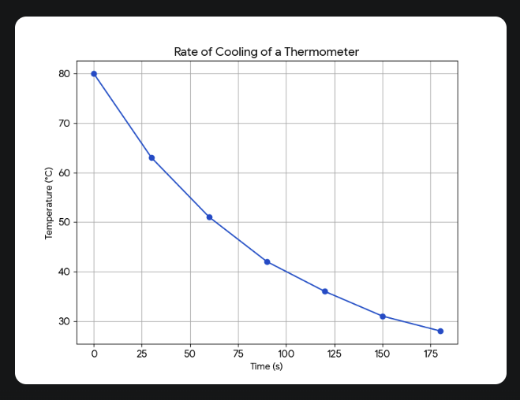
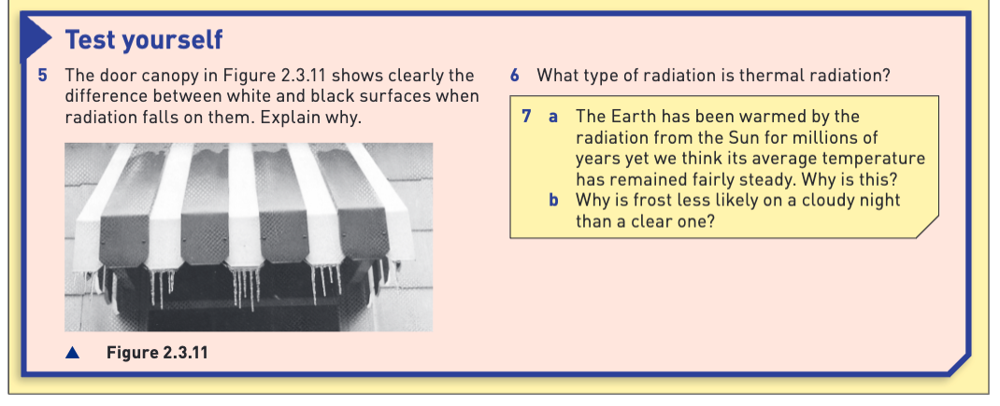
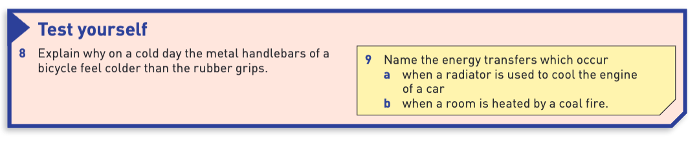
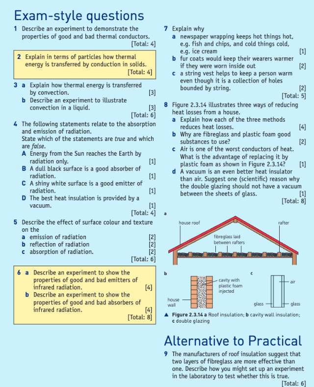

Thermal conduction is the transfer of heat energy through a substance without any movement of the substance itself. In **metals**, this happens in two ways:
1.  **Fast Process**: Metals have free-moving (delocalised) electrons. When heated, these electrons gain kinetic energy, move faster and further, and quickly transfer this energy to cooler parts of the metal by interacting with other particles. 
2.  **Slow Process**: The atoms in the hotter part of the metal vibrate more and cause their neighbouring atoms to vibrate as well, passing the energy along.

In **non-metals**, which lack free electrons, heat is only transferred through the slower process of atomic vibrations. This makes them poor conductors and good insulators.

**Liquids and gases** are generally poor conductors because their particles are farther apart and not in a fixed structure, making it difficult to transfer energy through vibrations.

***
## Test Yourself Answers

1.  **Thermal conduction** is the process where heat energy is transferred from hotter to colder parts of a substance through the interaction of its particles (atoms, molecules, or free electrons), without the substance as a whole moving.
2.  Thermal conduction is poor in gases and most liquids because their **particles are much farther apart** than in solids and they are not arranged in a fixed lattice. This makes it difficult to transfer energy efficiently through particle vibrations. Additionally, they do not have free electrons to aid in the transfer.
3.  
A surface's ability to give off (emit) heat radiation depends on its color and texture. **Dull, black surfaces are good emitters**, while **shiny, light-colored surfaces are bad emitters**.

---
## The Main Principle

The key rule is that surfaces that are good at **absorbing** heat are also good at **emitting** it.

* **Good Emitters (and Absorbers)**: Think of a black t-shirt on a sunny day. It absorbs a lot of sunlight and gets very hot. If you then move into the shade, it will also cool down quickly because it is efficiently radiating that absorbed heat away. The dull black surface of the copper sheet in the example feels warmer because it's releasing more heat radiation than the shiny side. 
* **Bad Emitters (and Absorbers)**: A shiny, polished saucepan is a poor emitter. This is an advantage because it means the saucepan **retains its heat for longer**, keeping your food warm. Similarly, a shiny surface reflects heat, which is why emergency blankets are silvery—to reflect your body heat back to you and keep you warm.

## Practical Applications

* **Refrigerator Coils**: The cooling fins at the back of a refrigerator are painted black. This makes them good emitters, allowing them to efficiently release unwanted heat into the room.
* **Thermos Flasks**: A thermos has a shiny, silvered inner surface. This is because a shiny surface is a poor emitter, which minimizes heat loss by radiation and keeps the contents hot for hours.
All bodies above absolute zero emit thermal energy as **infrared radiation**. Hotter objects, like the Sun, also emit shorter-wavelength radiation like light and UV. An object's temperature remains constant when the energy it absorbs equals the energy it emits.

The **greenhouse effect** occurs because some materials, like glass or greenhouse gases (CO₂), are transparent to the incoming short-wavelength radiation from the Sun but are opaque to the long-wavelength infrared radiation emitted by cooler objects on Earth. This process traps heat, causing a rise in temperature.

The **rate of cooling** of an object depends on its temperature. An object at a higher temperature than its surroundings emits radiation faster, and thus cools more quickly.

---
All bodies above absolute zero emit thermal energy as infrared radiation. Hotter objects, like the Sun, also emit shorter-wavelength radiation like light and UV. An object's temperature remains constant when the energy it absorbs equals the energy it emits.

The greenhouse effect occurs because some materials, like glass or greenhouse gases (CO₂), are transparent to the incoming short-wavelength radiation from the Sun but are opaque to the long-wavelength infrared radiation emitted by cooler objects on Earth. This process traps heat, causing a rise in temperature.

The rate of cooling of an object depends on its temperature. An object at a higher temperature than its surroundings emits radiation faster, and thus cools more quickly.
## Practical Work

**a. Plot a graph of temperature against time**
A graph would show **Time (s)** on the x-axis and **Temperature (°C)** on the y-axis. The plotted points would form a curve that is steep at the beginning and becomes gradually flatter as time increases. This indicates that the rate of cooling is fastest at the start and slows down over time. 

**b. Calculate the temperature drop**
i. **Between 0 s and 90 s:** The temperature drops from 80°C to 51°C.
   Temperature drop = $80 - 42 = 38 \, \text{°C}$

ii. **Between 90 s and 180 s:** The temperature drops from 51°C to 31°C.
    Temperature drop = $42 - 28 = 14 \, \text{°C}$

**c. State the temperature range over which the thermometer cools most quickly**
The thermometer cools most quickly in the first 90 seconds, over the temperature range of **80°C down to 42°C**. This is where the temperature drop is the greatest (38°C).

**d. Does the thermometer emit radiation at a higher rate at the higher or lower temperatures?**
The data shows that the thermometer cools fastest when it is hottest. Therefore, it emits radiation at a **higher rate at higher temperatures**.

---
## Test Yourself

**5. The door canopy in Figure 2.3.11 shows the difference between white and black surfaces when radiation falls on them. Explain why.**
Black surfaces are **good absorbers** of thermal radiation, while white surfaces are **poor absorbers** (they are good reflectors). When radiation from the sun falls on the canopy, the black surfaces absorb more energy than the white ones. This greater absorption of energy causes the temperature of the black surfaces to rise significantly higher than the white surfaces.

**6. What type of radiation is thermal radiation?**
Thermal radiation is mainly **infrared radiation**.

**7. a. The Earth has been warmed by the radiation from the Sun for millions of years yet we think its average temperature has remained fairly steady. Why is this?**
The Earth's average temperature has remained steady because it is in a state of **thermal equilibrium**. It emits energy into space at the same average rate that it absorbs energy from the Sun.

**b. Why is frost less likely on a cloudy night than a clear one?**
On a clear night, the ground radiates heat directly into space, allowing its temperature to drop significantly, often below freezing. On a cloudy night, the clouds act like a blanket. They trap the infrared radiation emitted by the Earth and radiate some of it back down, preventing the ground from cooling as much and making it less likely for frost to form.

### Many everyday applications use a combination of heat transfer methods:

* **Car Radiator:** Cools the engine using both **conduction** and **radiation**. Heat is conducted from the engine to a fluid, and then to the radiator fins. The black fins then radiate this heat away.
* **Wood or Coal Fire:** Heats a room using **radiation** and **convection**. The fire radiates heat directly to objects, while also heating the air above it, which then circulates throughout the room in a convection current.
* **Vacuum Flask (Thermos):** Keeps liquids at a stable temperature by minimizing all three types of heat transfer. A **vacuum** between the double walls stops conduction and convection, while **silvered surfaces** reflect thermal radiation. 
---
## Test Yourself

**8. Explain why on a cold day the metal handlebars of a bicycle feel colder than the rubber grips.**
The metal handlebars feel colder because metal is a **good thermal conductor**, while rubber is a poor thermal conductor (an insulator). Although both materials are at the same cold temperature, the metal conducts heat away from your hand much more quickly than the rubber does. This rapid loss of heat makes the metal *feel* colder.

**9. Name the energy transfers which occur:**
**a. when a radiator is used to cool the engine of a car**
The main energy transfers are **conduction** and **radiation**.

**b. when a room is heated by a coal fire**
The energy transfers are **radiation** and **convection**.

## Exam Style question

Here are the answers to the exam-style questions.

---
### 1. Experiment for Thermal Conductors
To demonstrate good and bad thermal conductors, place rods of different materials (e.g., copper, glass, and wood) of the same length and cross-section through a trough. Fill the trough with hot water so one end of each rod is heated. Place a small blob of wax at the other end of each rod.

Heat will conduct along the rods. The wax on the **copper rod will melt first**, as copper is a good thermal conductor. The wax on the **wood and glass rods will take much longer** to melt (or may not melt at all), as they are poor thermal conductors (insulators).

---
### 2. Heat Transfer in Solids (Particle Model)
In solids, thermal energy is transferred by **conduction**. This happens in two ways:
1.  **Lattice Vibrations:** Particles (atoms/ions) at the hot end of the solid gain kinetic energy and vibrate more vigorously. They collide with their neighbours, passing on the vibrations particle by particle through the solid. This is a relatively slow process and is the only method of conduction in non-metals.
2.  **Free Electron Transfer:** In **metals**, there are delocalised (free) electrons. These electrons at the hot end gain a lot of kinetic energy and move rapidly through the metal. They collide with ions in the cooler parts, transferring energy very quickly. This is why metals are excellent conductors of heat.

---
### 3. Convection
**a. Explanation:** Convection is the transfer of thermal energy in a fluid (a liquid or gas). When a part of the fluid is heated, its particles gain energy and move further apart, causing it to **expand and become less dense**. This warmer, less dense fluid rises. Cooler, denser fluid from above sinks to take its place. This continuous circulation of fluid is called a **convection current**, which transfers heat throughout the fluid.

**b. Experiment:** Place a beaker of water on a tripod and gauze. Drop a single small crystal of potassium permanganate to the bottom. Gently heat the beaker just below the crystal. As the water heats up, it will rise, carrying the dissolved purple dye with it. The purple stream will be seen to rise, move across the top, cool, and sink down the other side, clearly illustrating a convection current. 
---
### 4. True or False Statements
* **A.** Energy from the Sun reaches the Earth by radiation only. **True**.
* **B.** A dull black surface is a good absorber of radiation. **True**.
* **C.** A shiny white surface is a good emitter of radiation. **False**. (It's a poor emitter).
* **D.** The best heat insulation is provided by a vacuum. **True**.

---
### 5. Effect of Surface Colour and Texture
* **a. Emission:** **Dull, black surfaces** are good emitters of radiation. **Shiny, light-coloured surfaces** are poor emitters.
* **b. Reflection:** **Shiny, light-coloured surfaces** are good reflectors of radiation. **Dull, black surfaces** are poor reflectors.
* **c. Absorption:** **Dull, black surfaces** are good absorbers of radiation. **Shiny, light-coloured surfaces** are poor absorbers.

---
### 6. Experiments on Infrared Radiation
**a. Good and Bad Emitters:** Use a **Leslie's Cube**, a hollow metal cube with four different outer surfaces (e.g., shiny metal, white, dull black, matte black). Fill it with hot water and place it on a heat-proof mat. Use an infrared sensor at a fixed, close distance to measure the radiation emitted from each surface. The sensor will show the **highest reading for the dull black surface**, proving it is the best emitter.

**b. Good and Bad Absorbers:** Take two metal plates, one painted dull black and the other polished silver. Attach a thermometer to the back of each. Place a radiant heater an equal distance between the two plates. Switch on the heater. The thermometer on the **dull black plate will show a faster temperature rise**, proving it is the better absorber of infrared radiation.

---
### 7. Everyday Explanations
**a. Newspaper:** Newspaper is a poor conductor, but its main advantage is that it **traps many small pockets of air**. Air is an excellent insulator. These air pockets reduce heat transfer by both conduction and convection, slowing down heat from getting *in* (keeping things cold) or getting *out* (keeping things hot).

**b. Fur Coats:** A fur coat traps a layer of air close to the body. This trapped air reduces heat loss. If worn inside out, the fur is on the outside and cannot effectively trap this layer of body-warmed air. The smooth lining is less effective at trapping air, so heat is lost more quickly.

**c. String Vest:** The holes in a string vest trap a thick layer of air between the skin and outer clothing. This layer of trapped air is a poor conductor and reduces heat loss by preventing convection, thus keeping the person warm.

---
### 8. Heat Loss from a House
**a. How each method reduces heat loss:**
* **Roof Insulation:** Fibreglass is a poor conductor that traps large amounts of air. This reduces heat loss by **conduction** and **convection** through the roof, where most heat is typically lost.
* **Cavity Wall Insulation:** The foam is a poor conductor that fills the air gap in the walls, stopping air from circulating. This prevents heat loss through the walls by **convection**.
* **Double Glazing:** The layer of air trapped between the two glass panes is a poor conductor. It reduces heat loss by **conduction** and prevents **convection** currents from forming.

**b. Why are fibreglass and plastic foam good?**
They are materials that are poor conductors of heat and are excellent at trapping air, which is a very good insulator.

**c. Advantage of replacing air with foam (in cavity walls):**
While air is a good insulator, it can still transfer heat by convection if it can circulate. The foam stops these **convection currents** from forming within the cavity, making it a more effective insulator than an empty air gap.

**d. Vacuum in double glazing:**
A vacuum is a better insulator because it has almost no particles, so it stops heat transfer by **conduction** and **convection**. However, you should not have a vacuum in large double-glazed windows because the **huge pressure of the outside atmosphere** would push the two panes of glass together and cause them to shatter.

---
### 9. Experiment: Effectiveness of Fibreglass Layers
1.  **Setup:** Take two identical beakers and fill each with the same volume of hot water at the same starting temperature (e.g., 250 ml at 80°C).
2.  **Insulation:** Wrap one beaker with a single layer of fibreglass. Wrap the second beaker with two layers of fibreglass.
3.  **Measurement:** Place a thermometer in each beaker and cover both with a lid to reduce evaporation.
4.  **Data Collection:** Record the temperature of the water in both beakers every 2 minutes for a total of 20 minutes.
5.  **Control Variables:** The starting temperature and volume of water, the type of beaker, and the room temperature must be the same for both setups.
6.  **Conclusion:** Plot a graph of temperature against time for both beakers. The beaker that cools more slowly (its graph will be above the other) has the better insulation. You would expect the beaker with **two layers of fibreglass** to be more effective.